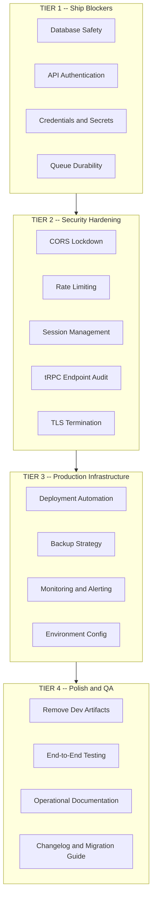
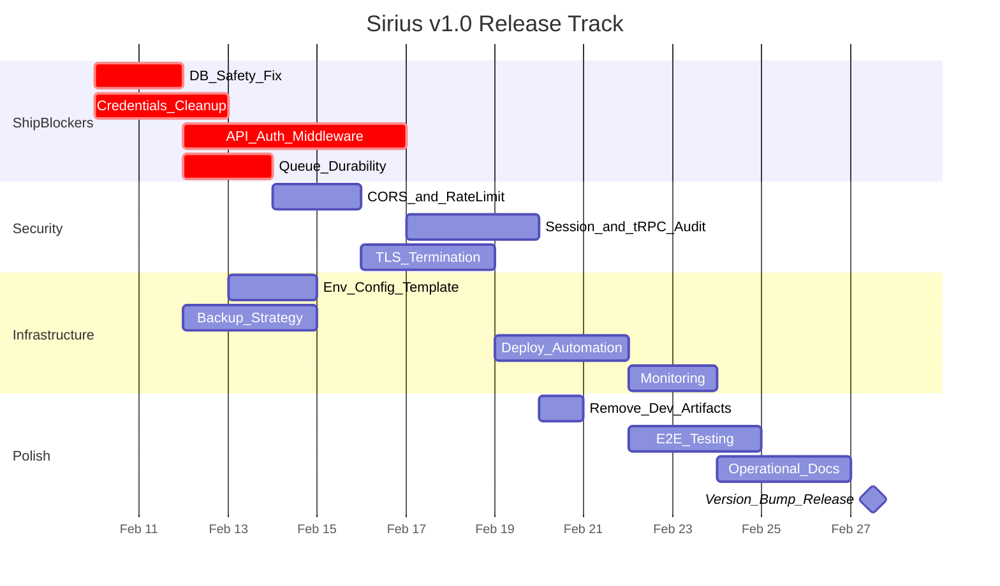

# Sirius v1.0 Production Release Readiness Plan

## Current State: v0.4.0

Six containers, five engine applications, a Next.js UI, a Go REST API, and a shared SDK -- all orchestrated via Docker Compose. Architecture is solid, UI is 75% production-ready, backend is well-structured but has critical gaps.

---

## TIER 1: Ship Blockers (Must fix -- data loss or security breach risk)

### 1.1 Database Wipes on Every Restart

**Severity: CRITICAL -- data destruction**

The SDK's database initialization unconditionally drops all tables on every startup:

`go-api/sirius/postgres/connection.go` line 179: `dropTablesInOrder()` is called inside `initializeSchema()`, which runs on every `GetDB()` call. This means every time sirius-api restarts, all PostgreSQL data is destroyed.

**Fix:**

- Gate `dropTablesInOrder()` behind an environment variable (e.g., `DB_RESET_SCHEMA=true`) that defaults to `false`
- Production compose must never set this flag
- Development compose can optionally set it
- Long-term: replace with a proper migration system (golang-migrate, goose, or Atlas)

### 1.2 No API Authentication or Authorization

**Severity: CRITICAL -- all endpoints publicly accessible**

`sirius-api/main.go` has no authentication middleware. Every handler in `sirius-api/handlers/` is reachable by anyone with network access. The scan, host, vulnerability, template, and event APIs are all wide open.

On the UI side, only 2 of 16 tRPC routers use `protectedProcedure` (terminal and agentScan). The other 14 use `publicProcedure`.

**Fix:**

- Add JWT or API-key authentication middleware to sirius-api (Fiber supports middleware chains)
- Audit all tRPC routers and move sensitive operations behind `protectedProcedure`
- Agent connections (gRPC) should require a shared secret or mTLS

### 1.3 Hardcoded Default Credentials

**Severity: CRITICAL -- known credentials in source code**

- **PostgreSQL**: Falls back to `postgres/postgres` if env vars unset (`go-api/sirius/postgres/connection.go`)
- **RabbitMQ**: Hardcoded `guest:guest` in queue SDK (`go-api/sirius/queue/queue.go`) and in app-terminal/app-administrator
- **NextAuth**: Default secret is `"change-this-secret-in-production-please"` in `sirius-ui/src/env.mjs`
- **Docker Compose**: Production compose uses `${POSTGRES_PASSWORD:-postgres}` defaults

**Fix:**

- Remove all fallback credentials from code -- fail loudly if env vars are missing
- Create a `.env.production.example` template with required variables documented
- Add startup validation that refuses to run with known-insecure defaults
- Document required secrets in a production deployment guide

### 1.4 Non-Durable Message Queues

**Severity: HIGH -- message loss on RabbitMQ restart**

All queue declarations in `go-api/sirius/queue/queue.go` use `durable: false` and `auto-ack: true`. This means:

- Messages are lost if RabbitMQ restarts
- Scan commands, terminal commands, and admin commands can silently vanish
- Failed message processing is never retried

**Fix:**

- Set `durable: true` for all production queues
- Implement manual acknowledgment for critical message types (scan commands)
- Gate durability behind `GO_ENV` or a dedicated flag so dev stays lightweight
- Consider adding a dead-letter queue for failed messages

---

## TIER 2: Security Hardening (Must fix -- vulnerability surface)

### 2.1 CORS Allows All Origins

`sirius-api/main.go` line 127: `allowedOrigins = "*"` when `CORS_ALLOWED_ORIGINS` is unset. Production must restrict this to the actual UI domain.

**Fix:** Set `CORS_ALLOWED_ORIGINS` in production compose to the UI's origin. Fail if unset in production mode.

### 2.2 No Rate Limiting

No rate limiting middleware exists in sirius-api. A single client can flood every endpoint.

**Fix:** Add Fiber rate limiter middleware (`fiber/limiter`). Start with a global limit (e.g., 100 req/min per IP), with higher limits on polling endpoints like health and statistics.

### 2.3 Session MaxAge is 100 Years

NextAuth session configuration uses an effectively infinite maxAge. Sessions never expire.

**Fix:** Reduce to a reasonable value (e.g., 24 hours for JWT, 7 days with refresh). Add session revocation capability.

### 2.4 tRPC Endpoint Authorization Audit

14 of 16 tRPC routers use `publicProcedure`. Sensitive operations like `store` (raw Valkey access), `queue` (raw RabbitMQ access), `scanner` (start scans), and `host` (modify hosts) should all require authentication.

**Fix:** Audit each router and classify endpoints as public (read-only, non-sensitive) or protected. Move write operations and admin functions behind `protectedProcedure`.

### 2.5 TLS Termination

No HTTPS configuration exists. All traffic is plaintext.

**Fix:** Add a reverse proxy (Traefik or Nginx) in front of the stack for TLS termination. Add a compose service or document external proxy setup. Consider Let's Encrypt for automated certificate management.

---

## TIER 3: Production Infrastructure (Should fix -- operational maturity)

### 3.1 Deployment Automation

The `deploy.yml` GitHub Actions workflow is a placeholder. There is no actual production deployment mechanism.

**Fix:**

- Complete the deploy workflow with actual SSH/Docker Compose deployment
- Implement environment-specific compose overrides (`docker-compose.prod.yaml`)
- Add rollback capability (tag-based image pinning)
- Decide on deployment strategy: manual trigger for v1 is fine, but document the exact steps

### 3.2 Database Backup Strategy

No backup mechanism exists. Combined with the schema-drop issue, this is high-risk.

**Fix:**

- Add a `pg_dump` cron job (can be a sidecar container or host script)
- Document backup/restore procedures
- Test restore from backup before launch
- Consider Valkey persistence configuration (RDB/AOF) for cache durability

### 3.3 Monitoring and Alerting

The system-monitor app collects metrics to Valkey, and the UI displays them, but there is no external alerting. If the system goes down, nobody is notified.

**Fix:**

- Add a `/health` endpoint to sirius-api (may already exist but should be verified and formalized)
- Consider Uptime Kuma, Healthchecks.io, or a simple webhook-based alerting for downtime
- Document on-call/monitoring procedures in a runbook

### 3.4 Environment Configuration Management

No `.env.production` template exists. Production secrets are handled ad-hoc.

**Fix:**

- Create `.env.production.example` listing every required variable with descriptions
- Document which variables are required vs optional
- Add a startup validation script that checks for required config before launching services
- Consider Docker secrets or an external secrets manager for sensitive values

---

## TIER 4: Polish and QA (Should do -- professional release quality)

### 4.1 Remove Development Artifacts

- `/queue-test` page in the UI should be removed or gated
- `example` tRPC router should be removed
- Mock scan data in `scanner.ts` router should be replaced or removed
- `test_valkey.go` in app-system-monitor conflicts with the main package (should be a build-tagged utility or moved to a `cmd/` subdirectory)

### 4.2 End-to-End Testing

Integration test scripts exist in `testing/container-testing/` but are not integrated into CI. No browser-based E2E tests exist.

**Fix:**

- Wire `test-health.sh` and `test-integration.sh` into the CI pipeline as a required check
- Add at least one smoke-test flow: login, start a scan, view results
- Document manual QA checklist for release verification

### 4.3 Operational Documentation

Missing documents for production operations:

- **Production Deployment Guide**: Step-by-step instructions for first-time and upgrade deployments
- **Runbook**: Common operational procedures (restart services, check logs, clear queues, restore backups)
- **Incident Response**: What to do when things break (escalation, rollback, data recovery)
- **Migration Guide**: Upgrading from v0.4.0 to v1.0 (breaking changes, data migration)

### 4.4 Changelog and Version Bump

- Update `CHANGELOG.md` with all v1.0 changes (significant given everything since v0.4.0)
- Bump version to `1.0.0` in `package.json`, compose files, and any version constants
- Tag the release in all repos (main + submodules)
- Write release notes for GitHub Releases

---

## Scope Decisions for the Product Group

These items are real but may be deferred past v1.0. The product group should explicitly decide on each:

- **API Documentation (OpenAPI/Swagger)**: Valuable for integrators but not blocking v1 launch
- **Horizontal Scaling**: Single-node Docker Compose is fine for v1; clustering can come later
- **Distributed Tracing**: Nice for debugging but not required at launch
- **CI Security Scanning (Trivy/Snyk)**: Recommended but can be added post-launch
- **Blue-Green / Canary Deployments**: Overkill for an initial release; simple rolling updates suffice
- **Multi-region Deployment**: Not needed for v1
- **Agent Authentication (mTLS)**: Important if agents run on untrusted networks; can ship with shared-secret auth first

---

## Recommended Execution Order

**Estimated timeline**: 4-5 weeks with a focused team, starting from the ship blockers in parallel and flowing into security, infra, and polish sequentially.

---

## Summary Table

- **Tier 1 (Ship Blockers)**: 4 items -- database safety, API auth, credentials, queue durability
- **Tier 2 (Security)**: 5 items -- CORS, rate limiting, sessions, tRPC audit, TLS
- **Tier 3 (Infrastructure)**: 4 items -- deployment, backups, monitoring, env config
- **Tier 4 (Polish)**: 4 items -- dev artifact cleanup, E2E testing, ops docs, release prep
- **Deferred Decisions**: 7 items for the product group to explicitly scope in or out
