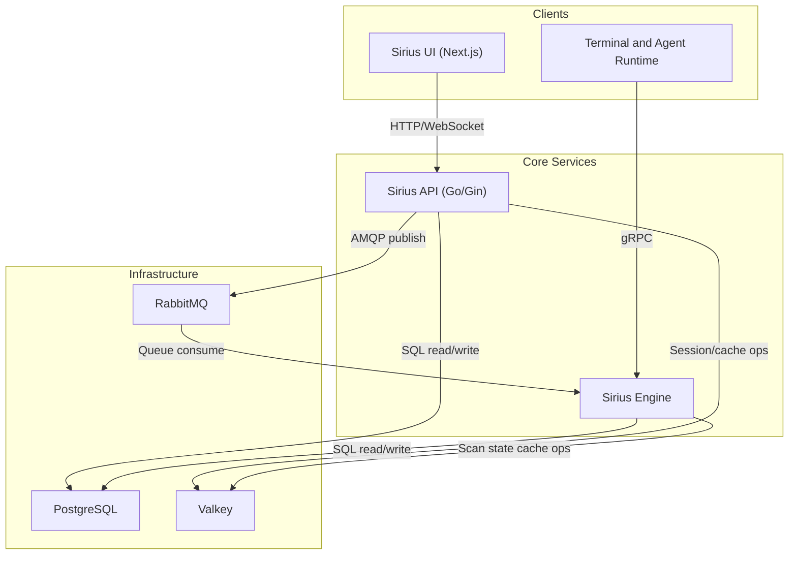

# Sirius Scan

[](https://github.com/SiriusScan/Sirius/actions/workflows/ci.yml)
[](https://github.com/SiriusScan/Sirius/releases)
[](https://github.com/orgs/SiriusScan/packages)
[](./LICENSE)
[](https://sirius.opensecurity.com/community)


Sirius is an open-source vulnerability scanner with automated discovery, CVE-based detection, and a modern web UI. Clone, run four commands, start scanning.

## Quick Start

```bash
git clone https://github.com/SiriusScan/Sirius.git
cd Sirius
docker compose -f docker-compose.installer.yaml run --rm sirius-installer
docker compose up -d
```

Open **http://localhost:3000** and log in:

| | |
|---|---|
| **Email** | `admin@example.com` |
| **Password** | printed by the installer (look for `INITIAL_ADMIN_PASSWORD` in the output) |

That's it. All six services start automatically. The installer generates secure secrets on first run and is safe to re-run.

> **Requirements:** Docker Engine 20.10+ with Compose V2, 4 GB RAM, 10 GB disk. Works on Linux, macOS, and Windows (WSL2).

## What Sirius Does

- **Network Discovery** -- automated host and service enumeration via Nmap
- **Vulnerability Detection** -- CVE-based scanning with CVSS scoring
- **Risk Dashboards** -- real-time scanning progress, severity trends, and remediation guidance
- **Remote Agents** -- distributed scanning across multiple environments via gRPC
- **Interactive Terminal** -- PowerShell console for advanced scripting and automation
- **REST API** -- integrate with existing security workflows (`X-API-Key` auth on port 9001)

## Deployment Options

The installer step is always the same. Only the `docker compose up` command changes.

| Mode | Command | Use case |
|------|---------|----------|
| **Standard** | `docker compose up -d` | Most users -- pulls release images from GHCR |
| **Development** | `docker compose -f docker-compose.yaml -f docker-compose.dev.yaml up -d` | Live-reload for local code work |
| **Production** | `docker compose -f docker-compose.yaml -f docker-compose.prod.yaml up -d` | Hardened settings, `pull_policy: always` |

### Non-interactive setup (CI / Terraform / automation)

```bash
docker compose -f docker-compose.installer.yaml run --rm sirius-installer --non-interactive --no-print-secrets
docker compose up -d
```

### Rotate secrets

```bash
docker compose -f docker-compose.installer.yaml run --rm sirius-installer --force
docker compose up -d --force-recreate
```

## Verify Installation

```bash
docker compose ps                    # all 6 services should show "healthy" or "running"
curl http://localhost:3000            # UI responds
curl http://localhost:9001/health     # API responds
```

Expected services: `sirius-ui` (3000), `sirius-api` (9001), `sirius-engine` (5174, 50051), `sirius-postgres` (5432), `sirius-rabbitmq` (5672, 15672), `sirius-valkey` (6379).

## Architecture



| Service | Technology | Ports | Purpose |
|---------|-----------|-------|---------|
| **sirius-ui** | Next.js 14, React, Tailwind | 3000 | Web interface |
| **sirius-api** | Go, Gin | 9001 | REST API and business logic |
| **sirius-engine** | Go + embedded gRPC agent | 5174, 50051 | Scanner, terminal, agent services |
| **sirius-postgres** | PostgreSQL 15 | 5432 | Vulnerability and scan data |
| **sirius-rabbitmq** | RabbitMQ | 5672, 15672 | Inter-service messaging |
| **sirius-valkey** | Valkey (Redis-compatible) | 6379 | Cache and session data |

## Interface

| Dashboard | Scanner | Vulnerability Navigator |
|-----------|---------|------------------------|
|  |  |  |

| Environment | Host Details | Terminal |
|-------------|--------------|----------|
|  |  |  |

## API

Sirius exposes REST endpoints on port 9001, protected by `SIRIUS_API_KEY`.

```bash
curl http://localhost:9001/health -H "X-API-Key: $SIRIUS_API_KEY"
curl http://localhost:9001/api/v1/scan/get/all -H "X-API-Key: $SIRIUS_API_KEY"
```

Full API docs: [REST API Reference](https://sirius.opensecurity.com/docs/api/rest/authentication)

## Security Recommendations

For production deployments:

1. **Rotate secrets** -- run the installer with `--force` to regenerate all credentials
2. **Restrict ports** -- only expose port 3000 (UI); keep 5432, 6379, 5672 internal
3. **Use a reverse proxy** -- put nginx or Traefik in front with TLS
4. **Keep images updated** -- `docker compose pull && docker compose up -d`

## Troubleshooting

Quick fixes for common problems:

| Problem | Fix |
|---------|-----|
| Services won't start | `docker compose logs <service>` to find the error |
| Dev overlay missing infra | Use both files: `-f docker-compose.yaml -f docker-compose.dev.yaml` |
| Port conflict | `lsof -i :3000` to find the conflicting process |
| Database connection error | `docker exec sirius-postgres pg_isready` |
| Stale secrets after reset | Re-run the installer, then `docker compose up -d --force-recreate` |

For detailed operational runbooks, verification procedures, and emergency recovery, see [Operations & Troubleshooting](./documentation/OPERATIONS.md).

## Contributing

See [CONTRIBUTING.md](./CONTRIBUTING.md) for development setup, coding standards, and PR guidelines.

**Quick links:** [Issues](https://github.com/SiriusScan/Sirius/issues) | [Discussions](https://github.com/SiriusScan/Sirius/discussions) | [Discord](https://sirius.opensecurity.com/community)

## Further Reading

- [Installation Guide](https://sirius.opensecurity.com/docs/getting-started/installation)
- [Interface Tour](https://sirius.opensecurity.com/docs/getting-started/interface-tour)
- [Scanning Guide](https://sirius.opensecurity.com/docs/guides/scanning)
- [Docker Architecture](./documentation/dev/architecture/README.docker-architecture.md)
- [System Architecture](./documentation/dev/architecture/README.architecture.md)
- [CI/CD Guide](./documentation/dev/architecture/README.cicd.md)
- [Operations & Troubleshooting](./documentation/OPERATIONS.md)

## License

[MIT](./LICENSE)
