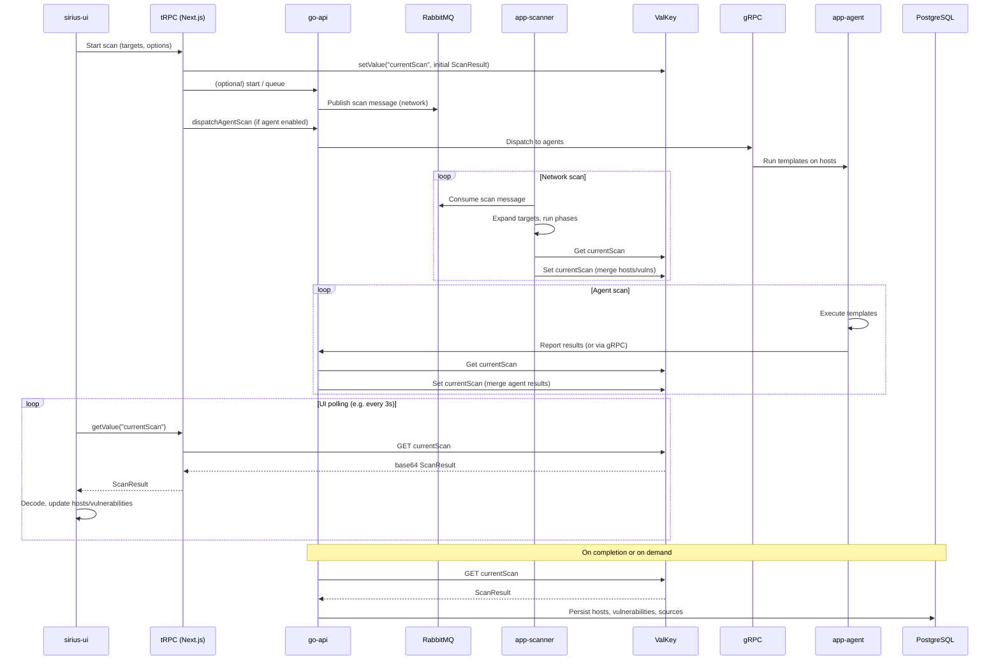

# Scanner Data Flow – End-to-End Architecture

This document describes the end-to-end data flow of the Sirius scanner system from the moment a user starts a scan in the UI until results are displayed and optionally persisted.

## Overview

The scanner system uses a **single live scan state** stored in ValKey under the key `currentScan`. The UI initiates scans via tRPC, triggers one or more sub-scans (network and/or agent), and polls ValKey for progress. When scans complete, results can be persisted from ValKey through go-api into PostgreSQL.

**Components involved:**

- **sirius-ui** (Next.js): Initiates scans, polls for results, displays hosts and vulnerabilities
- **go-api** (Go): REST API and persistence; can proxy queue/store or be called for cancel/persist
- **app-scanner** (Go): Network scanning; consumes from RabbitMQ, updates ValKey
- **app-agent** (Go): Agent-based scanning via gRPC; runs templates on remote hosts, results flow to ValKey
- **ValKey**: Stores live scan result as `currentScan` (base64-encoded JSON)
- **RabbitMQ**: Message queue between API/UI and app-scanner for network scan requests

---

## Network Scan Flow

1. **UI** – User configures targets and scan options, clicks “Start Scan”.
2. **tRPC** – UI calls `queue.sendMsg` (and optionally scanner/start endpoints) and `store.setValue` with key `currentScan` to write initial `ScanResult` (id, status, targets, empty hosts/vulnerabilities, `sub_scans.network`).
3. **go-api / Queue** – Scan request (id, targets, options, priority) is published to the **RabbitMQ** `scan` queue (either via go-api or via tRPC router in sirius-ui that publishes to RabbitMQ).
4. **app-scanner** – Consumes the message from the `scan` queue, expands targets to IPs, runs the scan pipeline (e.g. enumeration → discovery → vulnerability), and for each host/vulnerability discovered:
   - Reads current `currentScan` from ValKey (or receives it in context),
   - Merges new hosts/vulnerabilities and updates progress,
   - Writes updated `ScanResult` back to ValKey key `currentScan`.
5. **UI polling** – `useScanResults` polls `store.getValue({ key: "currentScan" })` (e.g. every 3s). The tRPC store router reads from ValKey and returns the value; UI decodes the base64 JSON and updates hosts/vulnerabilities for display.

So: **UI → tRPC → go-api (or tRPC) → RabbitMQ → app-scanner → ValKey → UI polling (tRPC store.getValue → ValKey).**

---

## Agent Scan Flow

1. **UI** – Same scan start; if agent scan is enabled, UI builds `sub_scans.agent` (status `dispatching`, progress 0/0) and writes initial `ScanResult` to ValKey via `store.setValue` with key `currentScan`.
2. **tRPC** – UI calls `agentScan.dispatchAgentScan` with scan id and agent scan config.
3. **go-api / gRPC** – go-api (or backend invoked by tRPC) uses **gRPC** to communicate with **app-agent** to dispatch template scans to connected agents.
4. **app-agent** – Runs templates on remote hosts, collects results, and reports back (e.g. via gRPC or callback to API). The component that holds the “current scan” state (e.g. go-api or a worker) updates the `currentScan` value in **ValKey**: merges agent-discovered hosts and vulnerabilities, updates `sub_scans.agent` status and progress.
5. **UI polling** – Same as network: UI polls `store.getValue("currentScan")`, decodes the result, and displays agent-origin hosts and vulnerabilities (with source attribution).

So: **UI → tRPC → go-api → gRPC → app-agent → (results) → ValKey → UI polling.**

---

## Persistence: ValKey (Live) → go-api → PostgreSQL

- **Live state** – The only source of truth during an active scan is ValKey key `currentScan`. All sub-scans (network, agent) read-modify-write this key to add hosts, vulnerabilities, and progress.
- **Persistent state** – After a scan completes (or on demand), the API layer can:
  - Read the final `ScanResult` from ValKey (`currentScan`),
  - Map hosts and vulnerabilities to the persistent model,
  - Write to **PostgreSQL** via go-api (hosts, vulnerabilities, scan_sources, etc.).

So: **ValKey (live) → go-api → PostgreSQL (persistent).** The UI can show live data from ValKey and, for history/reporting, data from go-api/PostgreSQL.

---

## Sequence Diagram (Mermaid)

---

## Key Data Structures

- **ValKey key:** `currentScan` (string value = base64-encoded JSON).
- **ScanResult (JSON):** `id`, `status`, `targets`, `hosts` (array of `HostEntry` with `id`, `ip`, `hostname`, `sources`), `hosts_completed`, `vulnerabilities`, `start_time`, `end_time`, `sub_scans` (map of sub-scan key → `SubScan`).
- **SubScan:** `type`, `enabled`, `status`, `progress` (`completed`, `total`, `label`), `metadata` (optional). Used for both network and agent sub-scans.

---

## Related Documentation

- [ARCHITECTURE.sub-scans.md](./ARCHITECTURE.sub-scans.md) – Sub-scan lifecycle and progress aggregation
- [ARCHITECTURE.host-deduplication.md](./ARCHITECTURE.host-deduplication.md) – How hosts from multiple sources are merged and displayed
- [README.scanner.md](./README.scanner.md) – Scanner engine details (message format, strategies, ValKey usage)

---

**Last Updated:** 2025-02-07  
**Version:** 1.0.0  
**Maintainer:** Sirius Team
