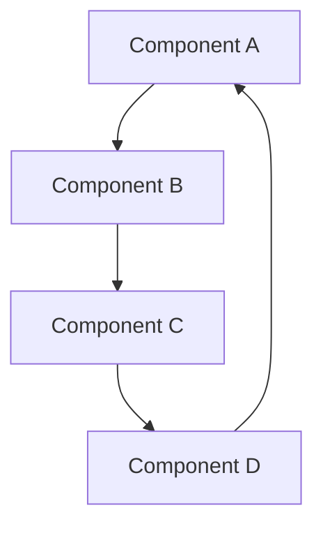

# [System/Component] Architecture

## Purpose

This document provides comprehensive architectural documentation for [specific system/component] within the Sirius project. ARCHITECTURE documents serve as authoritative sources for system design, component relationships, data flow, and structural decisions.

## When to Use

- **System Design**: When designing new systems or major components
- **Integration Planning**: When connecting systems or components
- **Code Review**: When reviewing implementation against architectural decisions
- **Onboarding**: When bringing new team members up to speed
- **Refactoring**: When making significant structural changes

## How to Use

### Quick Overview

1. **Start with the System Overview** to understand the big picture
2. **Review the Component Architecture** to understand individual parts
3. **Follow the Data Flow** to understand how information moves
4. **Check the Integration Points** to understand connections
5. **Reference the Design Decisions** for context on why choices were made

### Architecture Patterns

## What It Is

### System Overview

[High-level description of the system, its purpose, and key characteristics]

### Architectural Principles

- **[Principle 1]**: [Description and rationale]
- **[Principle 2]**: [Description and rationale]
- **[Principle 3]**: [Description and rationale]

### Component Architecture

#### [Component 1]

- **Purpose**: [What this component does]
- **Responsibilities**: [Key responsibilities]
- **Dependencies**: [What it depends on]
- **Interfaces**: [How it communicates with other components]

#### [Component 2]

- **Purpose**: [What this component does]
- **Responsibilities**: [Key responsibilities]
- **Dependencies**: [What it depends on]
- **Interfaces**: [How it communicates with other components]

#### [Component 3]

- **Purpose**: [What this component does]
- **Responsibilities**: [Key responsibilities]
- **Dependencies**: [What it depends on]
- **Interfaces**: [How it communicates with other components]

### Data Flow

#### [Flow 1]

1. **[Step 1]**: [Description of what happens]
2. **[Step 2]**: [Description of what happens]
3. **[Step 3]**: [Description of what happens]

#### [Flow 2]

1. **[Step 1]**: [Description of what happens]
2. **[Step 2]**: [Description of what happens]
3. **[Step 3]**: [Description of what happens]

### Integration Points

#### [Integration 1]

- **Type**: [API, Database, Message Queue, etc.]
- **Purpose**: [Why this integration exists]
- **Protocol**: [How communication happens]
- **Data Format**: [What data is exchanged]

#### [Integration 2]

- **Type**: [API, Database, Message Queue, etc.]
- **Purpose**: [Why this integration exists]
- **Protocol**: [How communication happens]
- **Data Format**: [What data is exchanged]

### Technology Stack

#### Backend

- **[Technology 1]**: [Purpose and rationale]
- **[Technology 2]**: [Purpose and rationale]
- **[Technology 3]**: [Purpose and rationale]

#### Frontend

- **[Technology 1]**: [Purpose and rationale]
- **[Technology 2]**: [Purpose and rationale]
- **[Technology 3]**: [Purpose and rationale]

#### Infrastructure

- **[Technology 1]**: [Purpose and rationale]
- **[Technology 2]**: [Purpose and rationale]
- **[Technology 3]**: [Purpose and rationale]

### Design Decisions

#### [Decision 1]

- **Context**: [What situation led to this decision]
- **Decision**: [What was decided]
- **Rationale**: [Why this decision was made]
- **Consequences**: [What this decision means for the system]

#### [Decision 2]

- **Context**: [What situation led to this decision]
- **Decision**: [What was decided]
- **Rationale**: [Why this decision was made]
- **Consequences**: [What this decision means for the system]

### Security Considerations

- **[Security Aspect 1]**: [How it's addressed]
- **[Security Aspect 2]**: [How it's addressed]
- **[Security Aspect 3]**: [How it's addressed]

### Performance Characteristics

- **[Performance Aspect 1]**: [Expected behavior and constraints]
- **[Performance Aspect 2]**: [Expected behavior and constraints]
- **[Performance Aspect 3]**: [Expected behavior and constraints]

### Scalability Considerations

- **[Scalability Aspect 1]**: [How the system scales]
- **[Scalability Aspect 2]**: [How the system scales]
- **[Scalability Aspect 3]**: [How the system scales]

## Troubleshooting

### FAQ

**Q: [Common architectural question 1]**
A: [Answer with architectural context and rationale]

**Q: [Common architectural question 2]**
A: [Answer with architectural context and rationale]

**Q: [Common architectural question 3]**
A: [Answer with architectural context and rationale]

### Command Reference

| Command      | Purpose        | Example     | Notes                   |
| ------------ | -------------- | ----------- | ----------------------- |
| `[command1]` | [What it does] | `[example]` | [Architectural context] |
| `[command2]` | [What it does] | `[example]` | [Architectural context] |
| `[command3]` | [What it does] | `[example]` | [Architectural context] |

### Common Issues

| Issue     | Symptoms          | Root Cause                       | Solution           |
| --------- | ----------------- | -------------------------------- | ------------------ |
| [Issue 1] | [How to identify] | [Why it happens architecturally] | [Step-by-step fix] |
| [Issue 2] | [How to identify] | [Why it happens architecturally] | [Step-by-step fix] |
| [Issue 3] | [How to identify] | [Why it happens architecturally] | [Step-by-step fix] |

### Debugging Steps

1. **Check [specific thing]**: [How to check and what to look for]
2. **Verify [specific thing]**: [How to verify and expected results]
3. **Test [specific thing]**: [How to test and success criteria]
4. **Review [specific thing]**: [What to review and common patterns]

## Lessons Learned

### [Date] - [What was learned]

[Description of architectural lesson learned and how it improved the system]

### [Date] - [What was learned]

[Description of architectural lesson learned and how it improved the system]

---

_This document follows the Sirius Documentation Standard. For questions about documentation structure, see [ABOUT.documentation.md](../ABOUT.documentation.md)._
